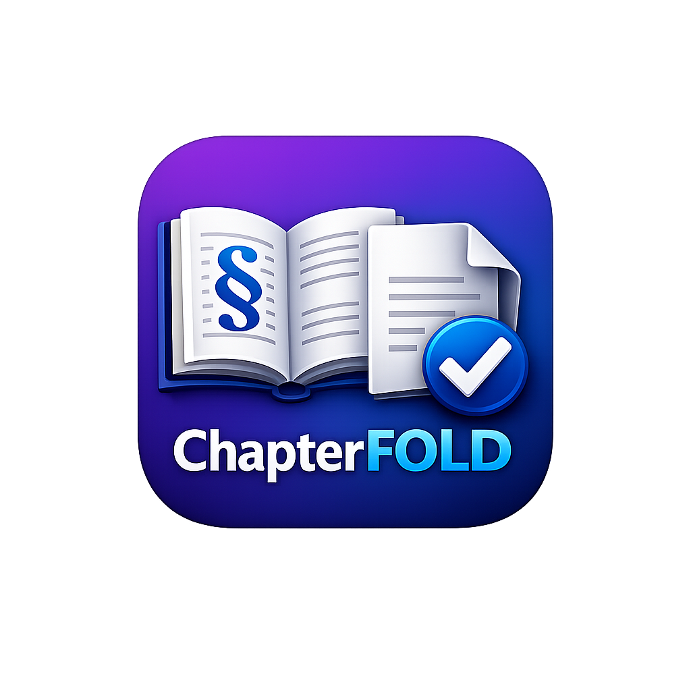
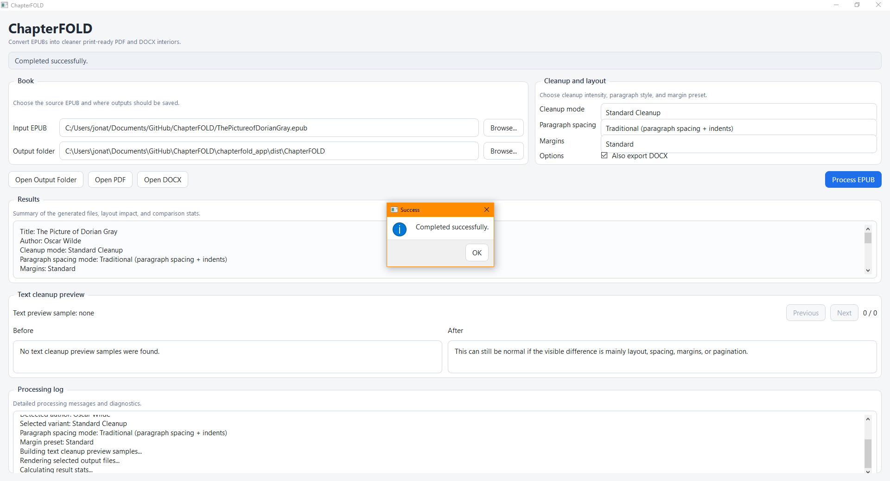

Absolutely — here is a complete updated `README.md` with a clearer **Windows user instructions** section, and with the screenshot shown only once.

````md
# ChapterFOLD

<p align="center">
  
</p>

Convert EPUBs into cleaner, print-ready PDF and DOCX interiors for bookbinding and personal printing.

## What ChapterFOLD does

ChapterFOLD is a Windows-first tool for turning EPUB books into cleaner, more practical outputs for printing, editing, and bookbinding.

It currently supports:

- EPUB to interior PDF
- EPUB to editable DOCX
- multiple cleanup modes for dialogue and paragraph issues
- paragraph spacing modes
- margin presets
- baseline comparison against standard cleanup
- text cleanup preview in the desktop app
- print-friendly output naming and layout controls

## Who it is for

ChapterFOLD is especially useful for:

- hobby bookbinders
- readers making personal physical copies
- fanfiction readers exporting EPUBs into printable interiors
- people who want more control over spacing, margins, and layout

## Windows user instructions

You do **not** need Python to use the release version.

### How to download and run the app

1. Go to the **Releases** section of this repository
2. Download the latest Windows release ZIP
3. Extract the ZIP fully to a normal folder on your PC
4. Open the extracted folder
5. Run `ChapterFOLD.exe`

### Important notes

- Do **not** run the app from inside the ZIP file
- Extract the whole ZIP first
- Keep all files in the extracted folder together
- If Windows shows a warning, click **More info** and then **Run anyway** if you trust the release source
- If the app does not start, try moving the extracted folder somewhere simple like your Desktop first

### Typical Windows flow

1. Download release ZIP
2. Right-click the ZIP and choose **Extract All**
3. Open the extracted `ChapterFOLD` folder
4. Double-click `ChapterFOLD.exe`
5. Choose your EPUB and output folder
6. Click **Process EPUB**

## Main desktop app features

The desktop app lets you:

- choose an input EPUB
- choose an output folder
- select a cleanup mode
- select a paragraph spacing mode
- select a margin preset
- optionally export DOCX
- compare results against a standard baseline
- preview text cleanup changes
- open the generated output files directly

## Cleanup modes

- **Standard Cleanup** — light cleanup for common EPUB formatting issues
- **Dialogue Merge** — better at merging dialogue split across paragraph boundaries
- **Aggressive Cleanup** — stronger cleanup heuristics for awkward spacing and broken dialogue continuity

## Paragraph spacing modes

- **Traditional** — paragraph spacing with indents
- **No indents** — keep paragraph spacing, remove indents
- **Indented compact** — minimal paragraph gap with indents
- **Uniform** — no extra paragraph gap and no indents

## Margin presets

- **Standard**
- **Compact**
- **Wide**
- **Large print friendly**

## Example desktop app view



## Running from source

These steps are only for developers or contributors working from the repository source code.

### Install dependencies

From the repo root:

```bash
pip install -r requirements.txt
pip install -r chapterfold_app/requirements.txt
````

### Run the desktop app

```bash
cd chapterfold_app
py app.py
```

## Building the Windows executable

From `chapterfold_app`:

```powershell
pyinstaller --noconfirm --windowed --name ChapterFOLD --icon assets\icon.ico --paths .. app.py
```

The built Windows app will appear under:

```text
chapterfold_app\dist\ChapterFOLD\
```

When sharing the app, distribute the **entire** `dist\ChapterFOLD\` folder or a ZIP of that folder.

## Script workflow

The repository also includes the earlier script-based workflow.

### Generate output variants

```bash
py Scripts/generate_variants.py "C:\path\to\book.epub"
```

### Test cleanup samples

```bash
py Scripts/test_cleanup_samples.py
```

Or with a sample file:

```bash
py Scripts/test_cleanup_samples.py Scripts\test_samples.txt
```

## Project structure

```text
ChapterFOLD/
├─ Archive/
├─ Scripts/
├─ chapterfold_app/
│  ├─ app.py
│  ├─ assets/
│  ├─ gui/
│  ├─ services/
│  └─ requirements.txt
├─ core/
├─ docs/
├─ tests/
├─ requirements.txt
└─ README.md
```

## Notes for Windows users running from source

If you are running from source rather than using the packaged release, WeasyPrint may require native Windows libraries to be available.

In some environments, this may require setting:

```powershell
$env:WEASYPRINT_DLL_DIRECTORIES="C:\msys64\ucrt64\bin"
```

before running the app or scripts.

Release users should not need to do this if the packaged app has been bundled correctly.

## Feedback wanted

Feedback is especially useful on:

* badly formatted EPUBs
* dialogue-heavy books
* odd paragraph spacing cases
* fanfiction EPUB exports
* margin and spacing preferences
* Windows packaging and usability issues

If you test the app, it is especially helpful to report:

* whether it launched successfully
* what EPUB you tested
* which cleanup mode you used
* whether the output looked better or worse
* any broken dialogue, spacing, or pagination issues

## Status

ChapterFOLD is currently an active early-stage project.

The desktop app is usable, but still evolving. Expect changes to cleanup heuristics, UI wording, output options, and packaging as more books and edge cases are tested.

## License

Add your preferred license here.

```

One small improvement I’d recommend later is renaming `docs/ChatperFOLD_Example.PNG` to something cleaner like `docs/chapterfold_example.png`.
```
